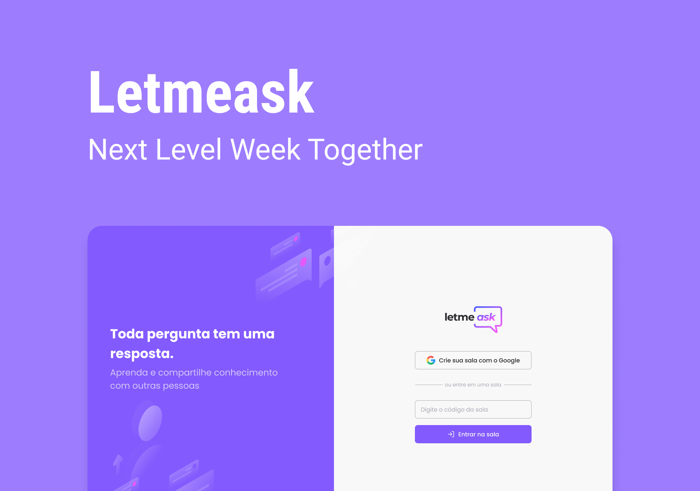

  

# Letmeask 

Desenvolvido durante a <strong>NLW#Together da Rocketseat </strong> :rocket:.
A aplicação tem como objetivo ajudar os criadores de conteúdo na obtenção de perguntas por meio da plataforma com sistema de ranqueamento com base em curtidas :sparkles:

<strong>Como funciona? </strong>
Crie uma sala para receber perguntas. Ao criar, um código será gerado e você poderá compartilhá-lo para que outras pessoas possam entrar na sala e mandar perguntas.
 

### :computer: Tecnologias utilizadas:
- React.js
- TypeScript
- Firebase
- Sass
 

#### ⚔️ Milha extra
- [x] dark mode
- [x] responsividade
- [ ] tema novo
- [x] erros/alertas, sugestão: react hot toast
- [x] criar modais (react-modal)
- [ ] separar pasta de componentes
- [ ] deploy firebase
